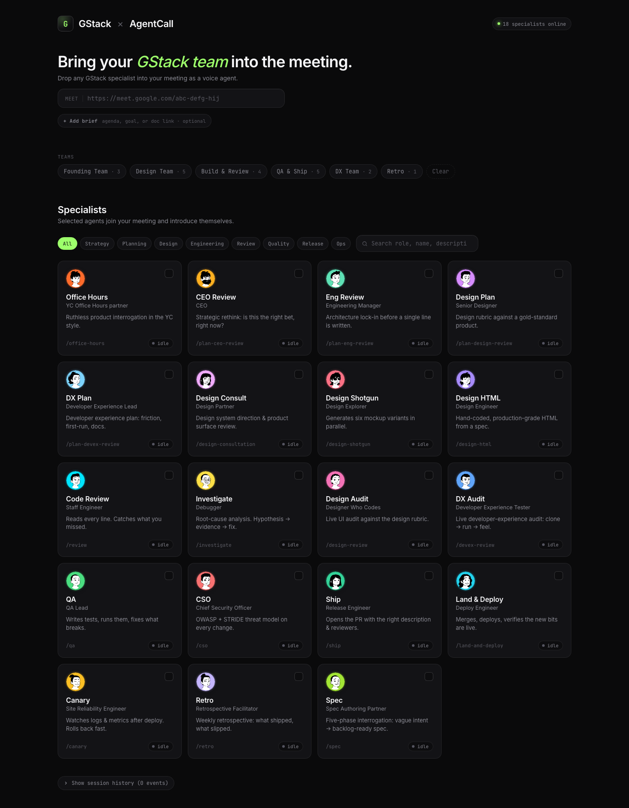

**Every [gstack](https://github.com/garrytan/gstack) specialist — CEO, CSO, QA Lead, Senior Designer, SRE, Spec Partner, and 13 others — joins your Google Meet, Zoom, or Teams as a real voice bot with its own 3D avatar.** Stdlib-only Python on the server, vanilla JS on the client, your Claude Code session as the brain. Open source. MIT.

Built and engineered by **Kartik Yadav** on top of [garrytan/gstack](https://github.com/garrytan/gstack) (the slash-command persona library, by **Garry Tan**, President & CEO of YC) and [AgentCall](https://agentcall.dev) (the meeting-bot platform). Huge thanks to Garry for shipping the personas — see [Thanks Garry](#thanks-garry) at the bottom.



---

## Install in 60 seconds

```bash
curl -fsSL [https://raw.githubusercontent.com/kartikyadav/gstack-joins-meeting/main/install](https://raw.githubusercontent.com/kartikyadav/gstack-joins-meeting/main/install) | bash
That clones the repo to ~/gstack-joins-meeting and registers it as a Claude Code skill at ~/.claude/skills/gstack-joins-meeting/. Then set your AgentCall key:Bashexport AGENTCALL_API_KEY="ak_ac_..."
That's it. Nothing to build, no requirements.txt, no Postgres. Open Claude Code and say:"Bring the CEO into this meeting: https://meet.google.com/abc-defg-hij"The CEO bot joins the call (~30s for avatar mode), introduces itself, listens, and replies in voice as you talk. Your Claude session is the brain — see SKILL.md for the brain-loop.Or open the dashboard manually:Bashpython3 ~/gstack-joins-meeting/server.py
# → http://localhost:8765 — paste Meet URL, pick specialists, dispatch
The rosteridNameRoleVoiceoffice-hoursYC Office HoursYC Office Hours partneram_michaelplan-ceo-reviewCEOCEOam_adamplan-eng-reviewEng ManagerEngineering Managerbm_georgeplan-design-reviewSenior DesignerSenior Designeraf_sarahplan-devex-reviewDX LeadDeveloper Experience Leadbf_emmadesign-consultationDesign PartnerDesign Partnerbf_isabelladesign-shotgunDesign ExplorerDesign Exploreraf_nicoledesign-htmlDesign EngineerDesign Engineeram_michaelreviewStaff EngineerStaff Engineerbm_lewisinvestigateDebuggerDebuggeram_adamdesign-reviewDesigner Who CodesDesigner Who Codesaf_belladevex-reviewDX TesterDeveloper Experience Testerbf_emmaqaQA LeadQA Leadaf_sarahcsoCSOChief Security Officeram_michaelshipRelease EngineerRelease Engineerbm_georgeland-and-deployDeploy EngineerDeploy Engineerbm_lewiscanarySRESite Reliability Engineeram_adamretroRetro FacilitatorRetrospective Facilitatorbm_georgespecSpec PartnerSpec Authoring Partnerbf_isabellaEach id maps 1:1 to an upstream gstack slash command (tracked against v1.47.0.0). The six built-in team presets — Founding, Design, Build & Review, QA & Ship, DX, Retro — live in data/teams.json.How it works


┌─────────────────────────────────────────────────────────────┐
│  YOUR LAPTOP                                                │
│                                                             │
│   ┌──────────────┐                                          │
│   │ Claude Code  │  Monitor /tmp/gstack-intelligence/inbox  │
│   │   session    │◄────────────────────────────────────────┐│
│   │ (the BRAIN)  │  Write replies → outbox/<id>.jsonl     ││
│   └──────┬───────┘                                         ││
│          │                                                 ││
│   ┌──────▼─────────┐    HTTP /dispatch   ┌───────────────┐ ││
│   │   server.py    ├────────────────────►│ specialist_   │ ││
│   │   :8765 dash   │   HTTP /dispatch    │   runner.py   │ ││
│   └────────────────┘                     │   (per bot)   │ ││
│                                          └────────┬──────┘ ││
│                                                   │        ││
│                                          bash launch-      ││
│                                          visual.sh         ││
│                                                   ▼        ││
│                                          ┌────────────────┐││
│                                          │ vendor/bridge- │││
│                                          │   visual.py    │││
│                                          └────────┬───────┘││
└───────────────────────────────────────────────────┼────────┘│
                                                     │         │
                                       AgentCall     │         │
                                       WebSocket     ▼         │
                                          ┌──────────────────┐│
                                          │   meet.google    │┘
                                          │      .com        │
                                          └──────────────────┘
Three things to internalize:The bots have no LLM. I built vendor/bridge.py and vendor/bridge-visual.py as stdin/stdout shims around AgentCall's WebSocket. They emit events (call.bot_ready, user.message, tts.done) and accept commands (tts.speak, send_chat, leave). All decision-making is done by you (Claude) via the intelligence bus.The intelligence bus is two files. /tmp/gstack-intelligence-$(id -u)/inbox.jsonl collects user transcripts. outbox/<id>.jsonl is where you append {"text":"…"} lines that get spoken by that specific bot.server.py is the dispatcher. A custom 700-line stdlib HTTP server I developed. No framework. No build step. The dashboard at localhost:8765 is one HTML file (index.html) reading data/specialists.json + data/teams.json as the single source of truth.See SKILL.md for the mandatory brain-loop (monitor inbox → reply in character → recall). See ARCHITECTURE.md for the full data flow.Repo layoutgstack-joins-meeting/
├── README.md                ← you are here
├── SKILL.md                 ← brain-loop instructions for Claude
├── CLAUDE.md                ← project-level Claude instructions
├── ARCHITECTURE.md          ← data flow + design decisions
├── CONTRIBUTING.md          ← how to add a specialist / mode
├── SECURITY.md              ← threat model + 9 findings (all addressed)
│
├── install                  ← one-line installer
├── server.py                ← dashboard + /dispatch + /recall  (stdlib HTTP)
├── specialist_runner.py     ← per-specialist runtime (one process per bot)
├── index.html               ← dashboard UI
├── specialists.js           ← AUTO-GENERATED from data/specialists.json on boot
├── data/                    ← canonical JSON: specialists, teams
├── avatars/                 ← per-specialist DiceBear character SVGs + glyph fallback
├── avatar-page/             ← bot's video feed (rendered by AgentCall headless browser)
├── vendor/                  ← vendored AgentCall bridges (with patches)
├── scripts/                 ← launch.sh, launch-visual.sh, kill-session.sh
├── bin/                     ← brain-status.sh diagnostic
│
└── hosted/                  ← OPTIONAL: multi-tenant wrapper for self-hosting a SaaS
                             variant. Most installers can ignore this entirely.
                             See hosted/README.md.
The hosted/ subtree is only for maintainers / operators. If you just want gstack specialists in your meetings, you never touch it.ModesModeWhat the bot hasLatencyavatar (default)Voice + 3D character avatar (DiceBear lorelei)~30s join, voice + visualaudioVoice only, no avatar tile~10s join, voice onlyAvatar mode tunnels a local python -m http.server on :3000 (serving avatar-page/) through AgentCall's WebSocket relay so each bot's video tile is a name-keyed SVG character.TroubleshootingThe common failure modes, in roughly the order you'll hit them:Bot joined but is silent. AudioContext on AgentCall's headless Chrome starts in suspended state. I patched .resume() in avatar-page/agentcall-audio.js. If you've forked, double-check that patch is intact. Audio mode skips this whole path — try mode: "audio" if avatar audio is failing.Bot greeted but never spoke again. No Claude session is monitoring inbox.jsonl. The bots have no LLM — see SKILL.md for the brain-loop. Run bin/brain-status.sh to check.Two bots talking over each other. The cross-bot speech lock at /tmp/gstack-intelligence-*/speaking.lock should prevent this. If you see overlap, the watchdog releases a stale lock after 12s. bash scripts/kill-session.sh sessions/session-<ts>/ is the hard reset./dispatch returns 200 but no bot. Check sessions/session-<latest>/orchestrator.log. AgentCall key issues show up as 401/403 on the first request.Recall doesn't take. bash scripts/kill-session.sh sessions/session-<ts>/ is the hard reset — appends {"command":"leave"} to every cmds file, then SIGTERM/SIGKILL.Try without installingI run a hosted demo at the URL in the repo description — paste a Meet URL, get a quick taste, no install required. If you like it, come back and run the 60-second install above so it uses your own Claude session + your own AgentCall key.(Want to host your own SaaS variant of gstack? See hosted/HOSTING.md.)Thanks, GarryThis project would not exist without Garry Tan — President & CEO of Y Combinator — open-sourcing gstack. Every specialist on this page (the way they ask questions, what they refuse to soften, the rhythm of their feedback) is his work. I designed this repo to bridge it directly to an active meeting tile.Thanks also for everything you do for the early-stage tech ecosystem — the founders you fund, the tools you ship, the public conversations you host. This is my way as a developer of saying it back.If you ship something on top of my version, tell us what you broke. PRs welcome — see CONTRIBUTING.md.CreatorKartik Yadav ## LicenseMIT. Same as upstream gstack and AgentCall.garrytan/gstack — the specialist personas. MIT.AgentCall — the meeting-bot platform. Commercial; free tier covers prototyping.
